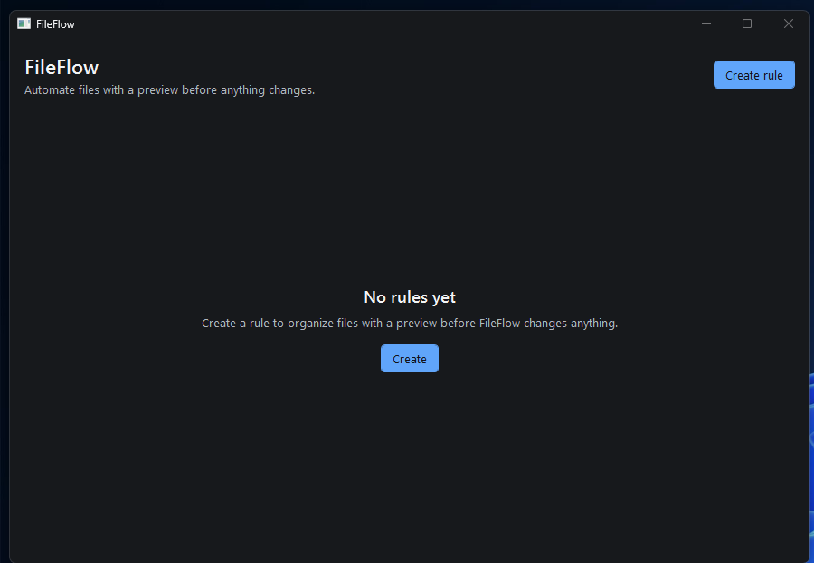

# FileFlow

[](https://github.com/CMf-pixel/FileFlow/actions/workflows/ci.yml)

A local Windows file automation tool that previews every planned operation before changing your files.

FileFlow turns a repeated folder cleanup into a saved rule: choose a source folder, file extensions, a Move or Copy action, and a destination. Every run starts with a reviewable preview and requires an explicit Execute click.

## Screenshot



## Why FileFlow

Moving a group of files by hand is tedious, while unattended automation can be hard to trust. FileFlow keeps the rule reusable and the operation visible. You see the exact source and destination of every planned file operation before anything changes.

## Features

- Save, edit, and delete local Move or Copy rules.
- Use a compact dark Windows desktop interface.
- Match file extensions case-insensitively, such as `.png` and `.jpg`.
- Preview every planned operation in a read-only step.
- Detect missing folders, destination conflicts, unsupported paths, and stale previews.
- Revalidate the complete batch before execution and validate each operation again immediately before it runs.
- Keep rules locally at `%LOCALAPPDATA%\FileFlow\rules.json`.
- Prevent two FileFlow instances from running for the same Windows user.
- Work locally without a cloud service or account.

## How it works

1. **Create a rule.** Choose a name, existing source and destination folders, one or more extensions, and Move or Copy.
2. **Run / Preview.** FileFlow scans only the files directly inside the source folder. Preview is read-only: it does not create directories, write probes, move files, or copy files.
3. **Review.** Check every planned source and destination. A blocking issue prevents the whole batch from executing.
4. **Execute.** FileFlow revalidates the entire preview before the first file operation. A rejected preflight makes zero filesystem mutations. During execution it validates each operation again and stops at the first failure.

## Usage

For a safe first run, create the empty folders `C:\FileFlowDemo\Inbox` and `C:\FileFlowDemo\Sorted`, then place a few test images in `Inbox`.

1. Choose **Create rule** and enter a name.
2. Set the source to `C:\FileFlowDemo\Inbox` and the destination to `C:\FileFlowDemo\Sorted`.
3. Enter `.png, .jpg` as the extensions. Copy is selected by default; keep it selected for this example.
4. Save the rule and choose **Run**.
5. Review every source and destination in Preview, then choose **Execute**.

## Download and run

Download `FileFlow-v0.1.0-win-x64.zip` from the [latest release](https://github.com/CMf-pixel/FileFlow/releases/latest).

The portable Windows x64 ZIP is self-contained: it is approximately 70 MiB compressed and 160 MiB after extraction, and it does not require a separate .NET installation.

1. Extract **all** files from the ZIP to a folder.
2. Run `FileFlow.App.exe` from the extracted folder.

The application is portable, but saved rules remain in `%LOCALAPPDATA%\FileFlow\rules.json`.

## Safety model

FileFlow never overwrites an existing destination. Preview is read-only, and every preview can be submitted only once. Before execution, FileFlow rechecks the full approved batch; any preflight problem rejects the batch without starting a file operation. It then validates each operation immediately before it runs and uses non-overwriting Move and Copy calls.

If a runtime check or file operation fails, FileFlow stops at that operation. Earlier operations can already have succeeded, so the filesystem may be partially changed. A failed operation can also leave partial output or an uncertain state. FileFlow has no rollback, transaction, or Undo, and execution cannot be cancelled after it starts.

These checks reduce filesystem races but cannot eliminate them. FileFlow does not lock paths, reserve destination names, hash file contents, or guarantee that a file cannot change between a check and an operation. Review the results and inspect both folders after any failure.

## Current limitations

- Windows x64 only.
- Rules match a file's direct extension only: `.gz` matches `archive.tar.gz`; compound patterns such as `.tar.gz`, wildcards, and extensionless matching are unsupported.
- Source and destination directories must already exist.
- UNC paths, mapped network drives, and reparse points are unsupported. Reparse points include junctions, symbolic links, and some cloud-storage placeholders.
- FileFlow scans only the immediate source folder. There is no recursive scan, folder watching, or scheduling.
- There is no Undo, rollback, transaction, conflict auto-resolution, or overwrite mode.
- There are no cloud services, accounts, or telemetry.
- Closing is disabled while execution is active; execution has no cancellation control.

## Build from source

Source builds require Windows and the .NET 8 SDK `8.0.400` or newer within the .NET 8.0 SDK line. From the repository root:

```powershell
dotnet restore FileFlow.sln
dotnet test FileFlow.sln --configuration Release --no-restore
dotnet build FileFlow.sln --configuration Release --no-restore
dotnet run --project src/FileFlow.App/FileFlow.App.csproj --configuration Release
```

## Contributing

Bug reports and focused fixes are welcome. Read [CONTRIBUTING.md](CONTRIBUTING.md) before starting; please discuss large scope changes first.

## License

FileFlow is available under the [MIT License](LICENSE).
